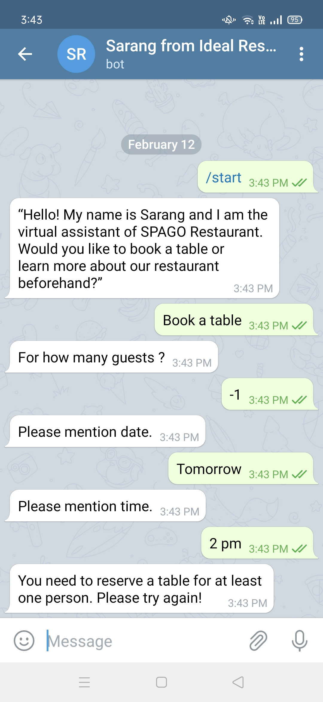

@AUTHOR : Sarang Bagul

# Restaurant-Booking-CHATBOT

Created a Restaurant Booking CHATBOT which makes the bookings of the customer. Also gives the overall information of the restaurant.
Small talks are included for the common questions like "How are you ?"

It also Validates the booking information for the following parameters:
1. Number of bookings should be atleast for 1 person
2. Date and time should be valid. As in booking date should not be the past date.

This chatbot is integrated with Telegram and Deployed it on GCP with Dialogflow.

  
  

Future Work:
Give few suggestion to the user as a Response (Follow-up Intents).
Store data in database.
Add more features like user name, update about booking details of the user etc.
